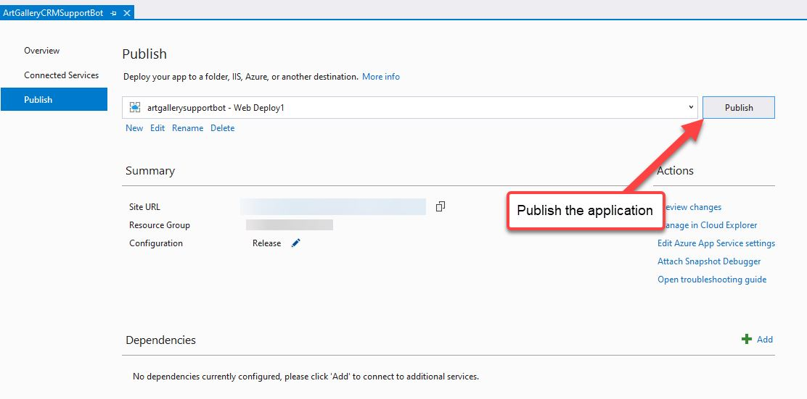
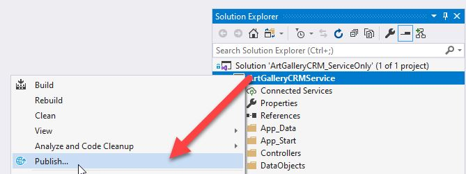
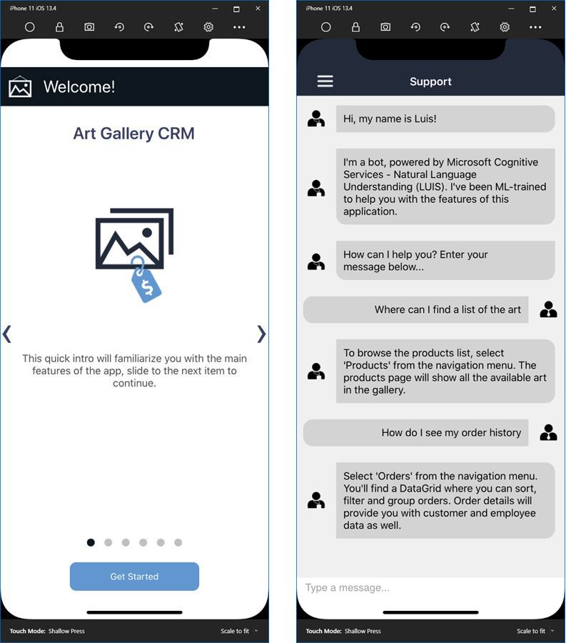


# CRM Demo Deployment

This readme will walk you through deploying the CRM example, which consists of three major parts: 

* Part 1. Deploying the bot service web application (ASP.NET)
* Part 2. Deploying the Mobile App service web application (ASP.NET)
* Part 3. Deploying the Xamarin application(s) (Xamarin.Forms for iOS, Android and UWP)

These steps will help you through deploying the applications. Indeed, there are scenario differences depending on your preferences. However, to keep this simple, we will use Azure as the deployment target as it is the most common and contains all the required resources (App Service, SQL server, Bot service, etc) in one place.

## Part 1. Deploying the Bot Web Application

The CRM bot is an application that is deployed to a web server and connected to Azure bot Service. There are fundamentally two parts to the implementation, the actual web application itself and the Azure service.

> It you're not familiar with bot or bot framework, we recommend you go through the [Quick-start Create an Echo Bot](https://docs.microsoft.com/en-us/azure/bot-service/dotnet/bot-builder-dotnet-sdk-quickstart?view=azure-bot-service-4.0) tutorial first to become familiar with the service.

#### Prerequisite

Before being able to deploy the code from this project, you will first need to create a Bot in your Azure App Portal. The quickest and easiest way to do this is to have Azure set everything up for you by using a new bot service template and then publishing/overwriting the templated one with CRM demo's version later.

Go to the [Azure Portal](portal.azure.com), create a new **Web App Bot** and follow all the steps until the boilerplate bot is deployed.

In order for direct communication from the app to the bot, you need to [enable the DirectLine Channel](https://docs.microsoft.com/en-us/azure/bot-service/bot-service-channel-connect-directline?view=azure-bot-service-3.0). Once enabled, temporarily copy the **DirectLine key** somewhere safe. You will be using this in the Xamarin.Forms project later.

Finally, copy out the **BotId**, you'll also need this in the Xamarin.Forms project:

> **Self-Hosting** If you want to publish the both to a location that is not an Azure app Service, you can still [Register the app with Azure Bot Service](https://docs.microsoft.com/en-us/azure/bot-service/bot-service-quickstart-registration?view=azure-bot-service-3.0).

Now that you have a bot service up and running in Azure, we can move on to publishing the CRM demo's more advanced version.

#### Step 1. Open the Bot Project in Visual Studio

Navigate to the `telerik-xamarin-forms-samples\ArtGalleryCRM\` folder and open the **ArtGalleryCRM_BotOnly.sln** solution in Visual Studio.

#### Step 2. Restore NuGet package and Build

Right-click on the Solution node and select **Restore NuGet packages**:

Once the packages have been restored, right-click on the project again and select **Build**

At this point, the project should build successfully and you're ready to update the constants used in the app for the Microsoft Cognitive services used by the bot.

#### Step 3. Fill in the Text Analysis and LUIS Subscription Keys

In the project, open the **Services/SubscriptionsKeys.cs** file.

You will find several string properties along with the links in the code comment above each property. Those links will show you how to setup the relevant Cognitive Service and get a key.

Once you create each service, come back to the SubscriptionKeys class and insert your key. 

Once all the keys are filled in, right-click on the project and select **Build** again.

#### Step 4. Publish the Application

Now it's time to publish the application to Azure. Right-click on the project and select **Publish...**

You should see the service available in the drop down if you're signed in

Sign into the account you use for Azure and then filter the list to find the bot service that you've previously setup (in the prerequisites section). Select it and click OK.

With the target selected, the publish profile is configured. Now publish it to Azure using the **Publish** button. 

I recommend testing the bot in the Azure portal before moving on `Azure Portal > Bot Services > [select your bot]` > **Test in Web Chat**.

## Part 2. Deploying the Mobile App Service Web Application

The CRM Mobile App Service application is an ASP.NET application that connects to a SQL server database and exposes an API for the mobile app. 

#### Step 1. Opening the solution in Visual Studio

Navigate to the `telerik-xamarin-forms-samples/ArtGalleryCRM/` folder and open the **ArtGalleryCRM_ServiceOnly.sln** file in Visual Studio.

#### Step 2. Restore NuGet Packages and Build

Right-click on the Solution and select **Restore NuGet Packages**

Right-click on the project and select **Build**

#### Step 3. Publish the Web Application

This is similar to what you did in Part 1 for the bot application, but this time we'll create a new App Service and SQL database.

Right-click on the project in the Solution Explorer and select **Publish...**.

Select **Create New** and click the **Create Profile** button.

Complete the options for the App Service, then click **Create a SQL Database**.

In the Azure SQL database dialog, fill in the details so the SQL server can create a new database, then click OK:

> If you do not already have a SQL server on Azure, use the "New..." option to the right of the drop-down to create one.

Now, back on the New App Service dialog, click **Create**. Visual Studio will spend a few seconds creating the publish profile.

you should now see the and Publish view. 

> Copy and paste the URL into a temporary location (i.e. Notepad), you will need to use it in the Xamarin.Forms app.

There's one last thing to do in order for the SQL database to updated with the seed data (see Models/ArtGalleryCRMInitializer.cs if you want to see where the initial data comes from)..

After this is done,  go ahead and click **Publish**. 

> Entity Framework Note: If you skipped the SQL server part and need to use an existing database, you can run the `Update-Database` Entity Framework command from Visual Studio **Package Manager Console**. See [Entity Framework - Code First Migration](https://docs.microsoft.com/en-us/ef/ef6/modeling/code-first/migrations/). 

## Part 3. Deploy the Xamarin.Forms Application

Now that the web applications are published and running, it's time to move on to the Xamarin.Forms project.

#### Step 1. Open the Solution in Visual Studio

Navigate to the `telerik-xamarin-forms-samples\ArtGalleryCRM` folder and open the **ArtGalleryCRM_FormsOnly.sln** file in Visual Studio:

You should see all 4 projects load in Visual Studio solution Explorer:

#### Step 2. Confirming or Configuring Telerik Assembly References

To make this as seamless as possible, the projects use the UI for Xamarin installation folder for the Telerik assembly references `C:\Program Files (x86)\Progress\Telerik UI for Xamarin [RELEASE VERSION]\Binaries`. This means you should just be able to build the project immediately. 

If you already have the latest version of Telerik UI for Xamarin installed, **skip to Step 3**. If you're on an older version or on a Mac, see the next section before continuing.

##### How To: Fix Broken Assembly References

If you're on a Mac or have an old version of UI for Xamarin installed on PC, you may see those references with a little warning icon.  If you need to repair the references, follow the instructions in the section relevant for you:

**Fix for Mac:**

1. Close Visual Studio
2. [Download the **PKG** installer file](https://docs.telerik.com/devtools/xamarin/installation-and-deployment/download-product-files) from your account downloads
3. Right click on the pkg file, expand "Open with..." anbd select "Installer" (*if you see a security warning, click "Open" in the popup*)
4. See the [Manually Add Required Assemblies](https://docs.telerik.com/devtools/xamarin/installation-and-deployment/mac/getting-started-mac#manually-add-required-assemblies) article for instructions on where to find the Binaries folder.
5. Open the **ErpApp.sln** solution in Visual Studio again

**Fix for PC:**

1. Close Visual Studio
2. [Download the **MSI** installer file](https://docs.telerik.com/devtools/xamarin/installation-and-deployment/download-product-files) from your account downloads
3. Run the MSI installer until complete
4. Open the **ErpApp.sln** solution in Visual Studio again

#### Step 3. Choosing Deploy Target

At this point, your Telerik assembly references are resolved and can build the solution, but we want to make sure you have the most efficient experience when building.

Right-Click on the project head that you want to target and select "**Set as StartUp Project**". For example, if you want to deploy to iOS, this is what it will look like:

For the initial exploration, you'll want to choose Debug and a non-device option to keep the build time short and simple. 

For iOS, choose **Debug - iPhone Simulator**:

For Android, choose **Debug - Any CPU**:

For UWP, choose **Debug - x86**:

#### Step 4. Update Service URL and Keys

Almost done! You only need to add a few values to class library project and you can run it.

1. Expand the `ArtGalleryCRM.Forms/Common` folder and open the **ServiceConstants.cs** file

2. Update the properties with your service values

* `AzureMobileAppUrl` is the Mobile App Service URL from **Part 2 - Step 3** above (e.g. `https://myappservicename.azurewebsites.net`)
* `DirectLineSecret` is the value you got in **Part 1 - Prerequisite 2** above (e.g. `Pxw2j5nYWC8.cAw.735.XPE-L_XQg5ihVZlEK4IjMjUIWPbn4Ul1IXf5j1V7Wdp`).
* `BotId` is the value you got in **Part 1 - Prerequisite 3** above (e.g. `MyIntelligentSupportBot`).

#### Step 5. Build and Deploy

It's showtime! Take the following steps to see the app running:

1. Right-click on the start up project and select **Rebuild**

2. Make sure the proper target is still selected, then select **Debug > Start without Debugging** (or just use Ctrl-F5)

3. Explore the app!

