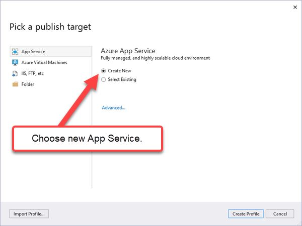
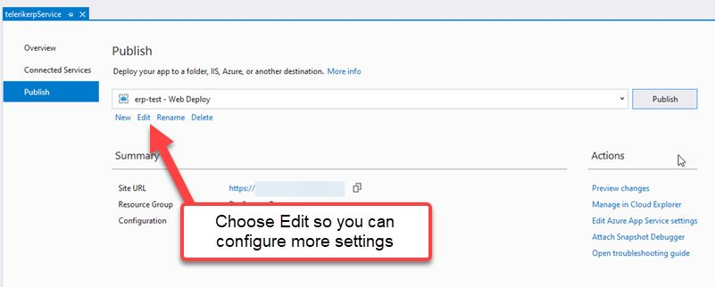
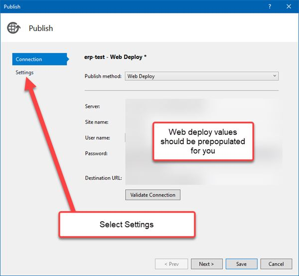
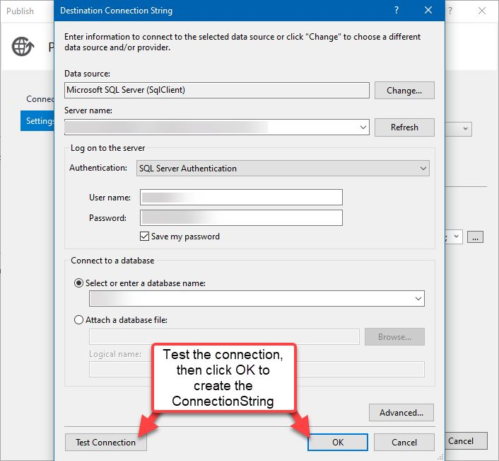
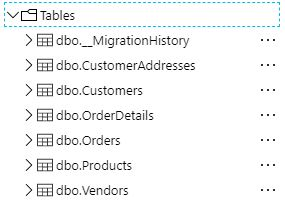
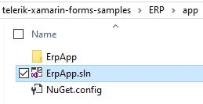
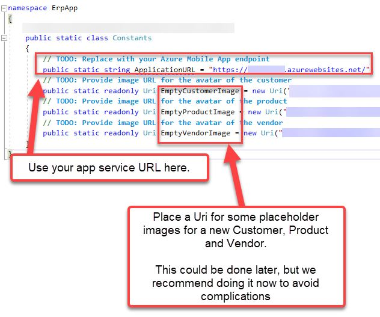
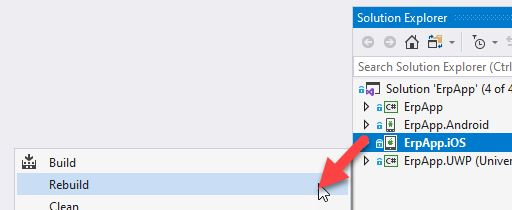


# ERP Deployment

The ERP demo has two major parts; Web application and Xamarin.Forms applications. This readme will take you through deploying them in your environment.

## Part 1. Web Application Setup

The ERP service application is an ASP.NET application that connects to a SQL server database. In this tutorial we will be deploying it to an Azure App Service, but you can technically deploy it to any web server you prefer.

#### Step 1. Opening the solution in Visual Studio

After you've downloaded (or cloned) the repostiry, navigate to the `telerik-xamarin-forms-samples/ERP/service/` folder and open the **telerikerp.sln** file.

#### Step 2. Restore the solution's NuGet packages.

1. Right-click on the Solution (not the project)
2. Select "Restore NuGet Packages"
3. Rick-click on the solution and select Build

When the build is complete, you can move on to publishing the web application.

#### Step 3. Publish the Web Application

Right-click on the project in the Solution Explorer and select "**Publish...**". The publish target wizard will let you select an endpoint. App Service, Virtual Machine, IIS/FTP or Folder.

In this walkthrough we're using Azure App Service, if you do not have a pre-existing one, you can select "New" and then "Create Profile"

The App Service wizard will walk you through creating the new Azure App Service, on the last step you'll see the following:

After this is done, you'll see a Publish Profile on the Publish page. This has the settings to successfully deploy the application to Azure.

If you already have a SQL database setup, go ahead and click **Publish**. If you do not 

#### Extra 1 - SQL Server

If you did not create a new SQL database in the previous step and need to add a conneciton string to your existing server. To update this, select the Edit button:

Select "Settings" tab:

Depending on how you setup your SQL server, you should already have a connection string that you can paste in now:

If you do not have a connection string handy, you can get one by using the ellipsis and signing into the SQL server

After you've saved the PublishProfile edits, you can go ahead and publish the application using the **Publish** button at the top right.

#### Extra 2 - Code-First Migration and Seed Data

The demo project has already scaffolded the IntialMigrate for you using [Entity Framework - Code First Migration](https://docs.microsoft.com/en-us/ef/ef6/modeling/code-first/migrations/)

You only need to open Visual Studio **Package Manager Console** and run the `Update-Database` Entity Framework command.  You should see the following as a result:

> If this does not work, double check the connection string in web.config is correct and the database is valid. The command and migrations only work if there is a valid connection to the SQL server and database. If you have experience with SSMS, you can also manually run the initial migration script if you prefer.

#### Step 4. Confirming Successful Deployment

There are two things to check before moving on:

##### Confirmation 1
Confirm the App service URL is loading in the browser, you'll see a blue Azure page stating the successful deployment

> Copy this URL somewhere else for easy access later (e.g. Notepad), you will need it for the Xamarin.Forms project (Part 2 below).

##### Confirmation 2
Confirm the `Update-Database` script ran successfully and the database has the sample data seeded. You should see several tables available, each populated with data.

If one of these is not working, revisit the previous steps. For more information, visit the Microsoft Documentation on Azure and SQL Databases. The [Create an App Service with SQL Database tutorial](https://docs.microsoft.com/en-us/azure/app-service/app-service-web-tutorial-dotnet-sqldatabase) is an amazing resource that shows how to create an App Service and a SQL Database at the same time.

## Deploy the Xamarin.Forms Application

Now that the web application is running, it's time to move on to the Xamarin.Forms project.

#### Step 1. Open the Solution in Visual Studio

Navigate to the `telerik-xamarin-forms-samples/ERP/app/` folder and open the **ErpApp.sln** file in Visual Studio:

You should see all 4 projects load in Visual Studio solution Explorer:

#### Step 2. Confirming or Configuring Telerik Assembly References

You should just be able to build the project immediately. However, due to timing of releases, it could be possible that you don't have the latest version of UI for Xamarin installed on your machine.

If you already have the latest version of Telerik UI for Xamarin installed and do not see any assembly reference issues in the loaded projects, **skip to Step 3**.

##### How To: Fix Broken Assembly References

The project uses the UI for Xamarin installation folder for the Telerik assembly references:

 
If you're on a Mac or have an old version of UI for Xamarin installed on PC, you may see those references with a little warning icon.  If you need to repair the references, follow the instructions in the section relevant for you:

**Fix for Mac:**

1. Close Visual Studio
2. [Download the **PKG** installer file](https://docs.telerik.com/devtools/xamarin/installation-and-deployment/download-product-files) from your account downloads
3. Right click on the pkg file, expand "Open with..." anbd select "Installer" (*if you see a security warning, click "Open" in the popup*)
4. See the [Manually Add Required Assemblies](https://docs.telerik.com/devtools/xamarin/installation-and-deployment/mac/getting-started-mac#manually-add-required-assemblies) article for instructions on where to find the Binaries folder.
5. Open the **ErpApp.sln** solution in Visual Studio again

**Fix for PC:**

1. Close Visual Studio
2. [Download the **MSI** installer file](https://docs.telerik.com/devtools/xamarin/installation-and-deployment/download-product-files) from your account downloads
3. Run the MSI installer until complete
4. Open the **ErpApp.sln** solution in Visual Studio again

#### Step 3. Choosing Deploy Target

At this point, your Telerik assembly references are resolved and can build the solution, but we want to make sure you have the most efficient experience when building.

Right-Click on the project head that you want to target and select "**Set as StartUp Project**". For example, if you want to deploy to iOS, this is what it will look like:

For these first few builds, you'll want to choose Debug and a non-device option tp keep the build time short and simple. 

For iOS, choose **Debug - iPhone Simulator**:

For Android, choose **Debug - Any CPU**:

For UWP, choose **Debug - x86**:

#### Step 4. Update Constants.cs

Almost done! You only need to add a few values to class library project and you can run it.

1. Open the ErpApp **Constants.cs** file

2. Add the App Service URL and add image URLs

Update the `ApplicationUrl` value with the URL to the web application (*you should have put this aside from Part 1 - Step 4*) and save the file.

#### Step 5. Build and Deploy

It's showtime! Take the following steps to see the app running:

1. Right-click on the start up project and select **Rebuild**

2. Make sure the proper target is still selected, then select **Debug > Start without Debugging** (or just use Ctrl-F5)

3. Explore the app!

> The initial sign-in page has the sample credentials already filled in, just click the **Login** button

